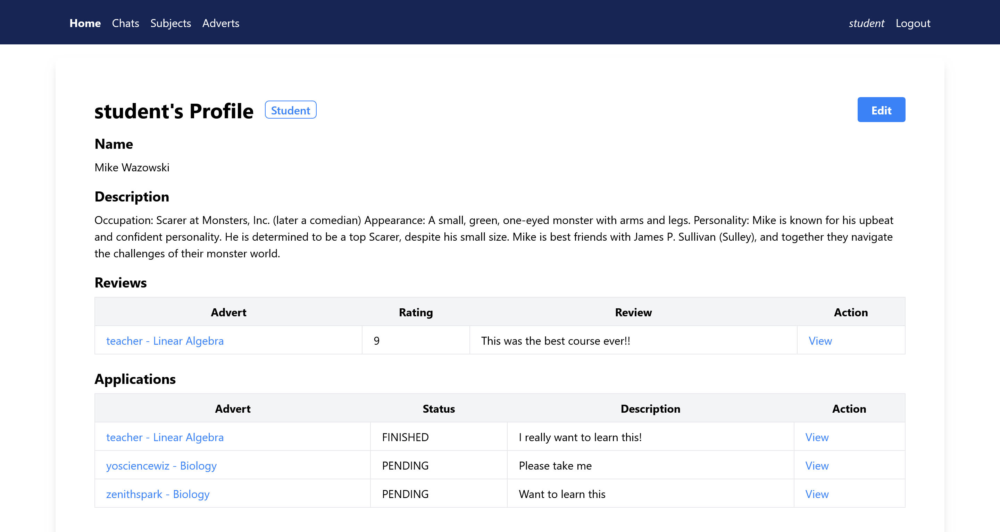
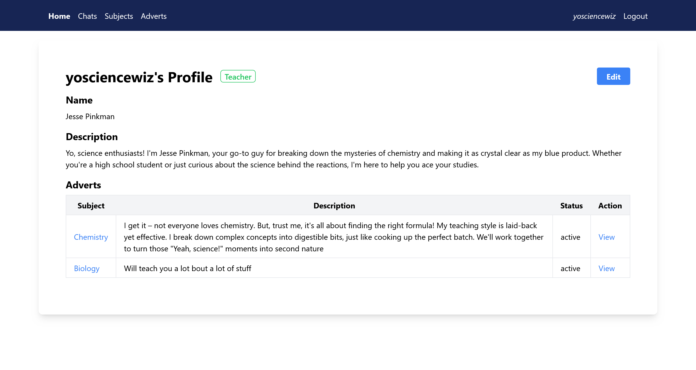
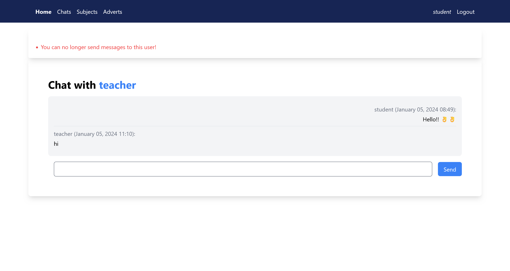
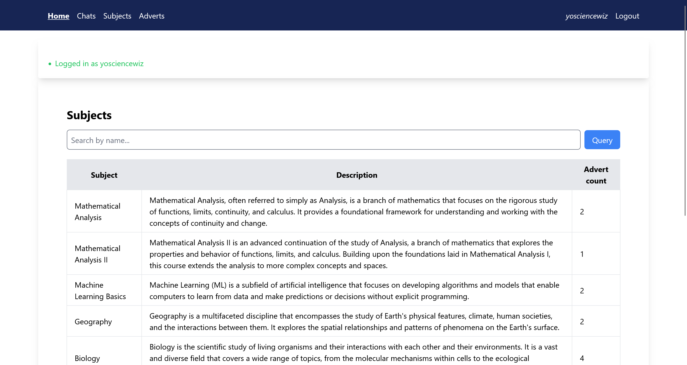
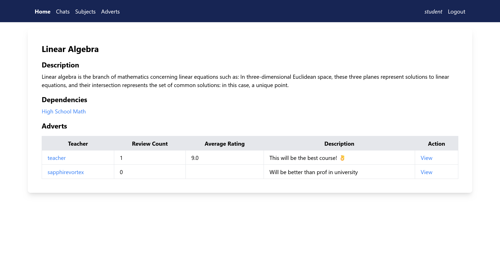
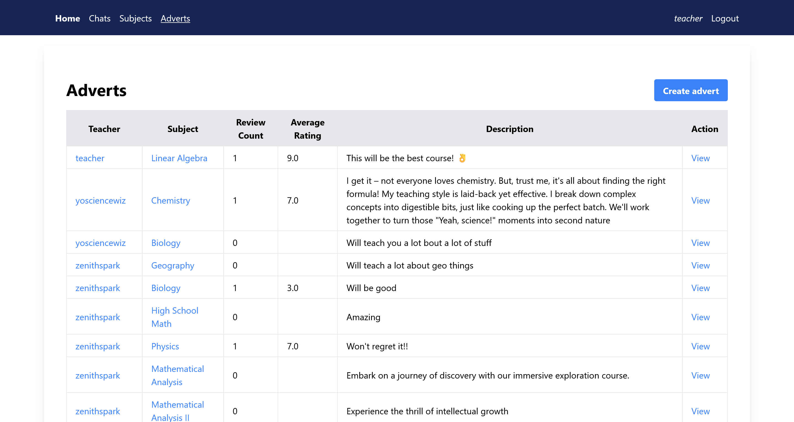
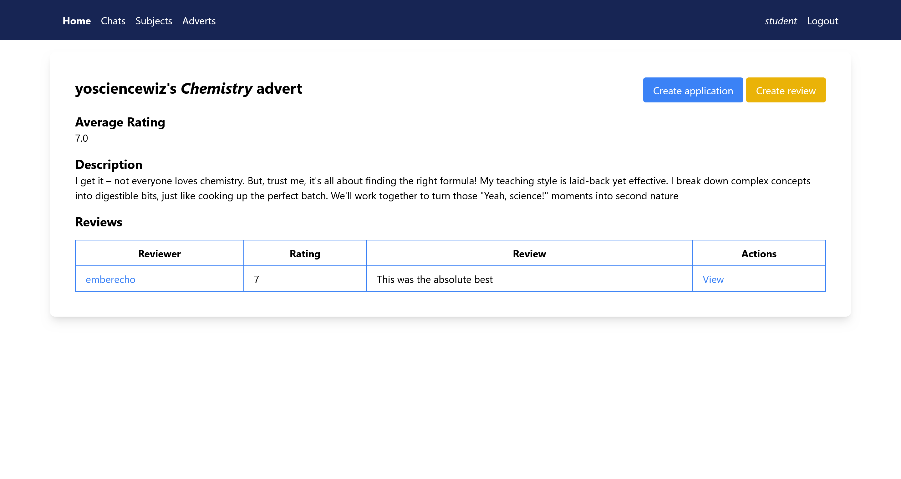
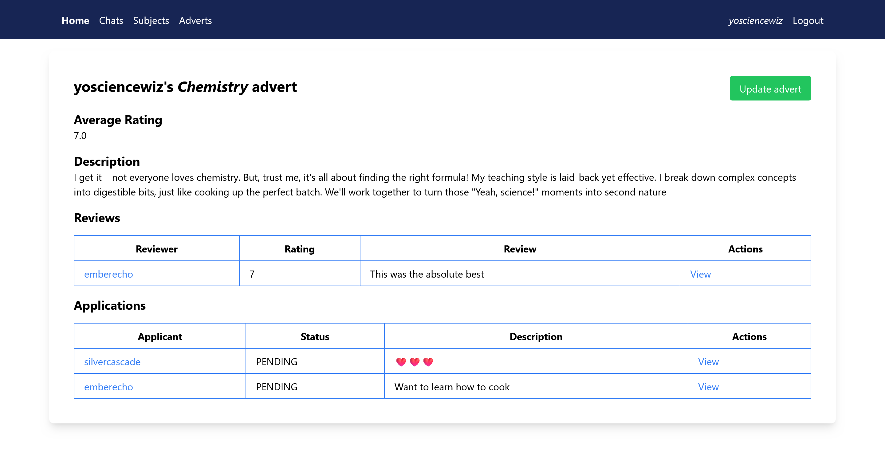
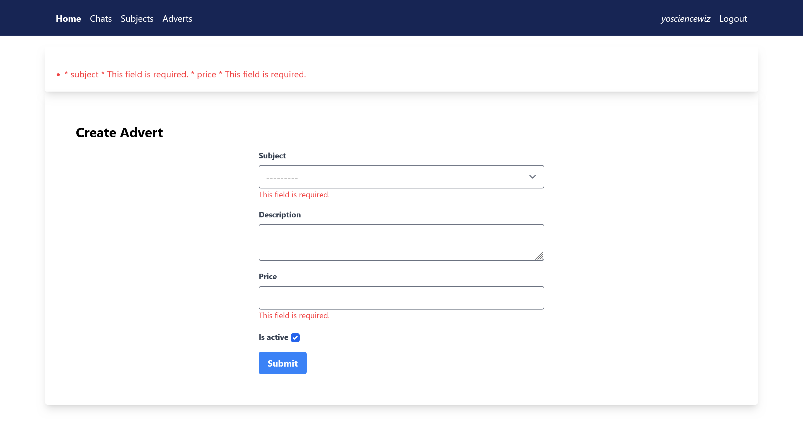
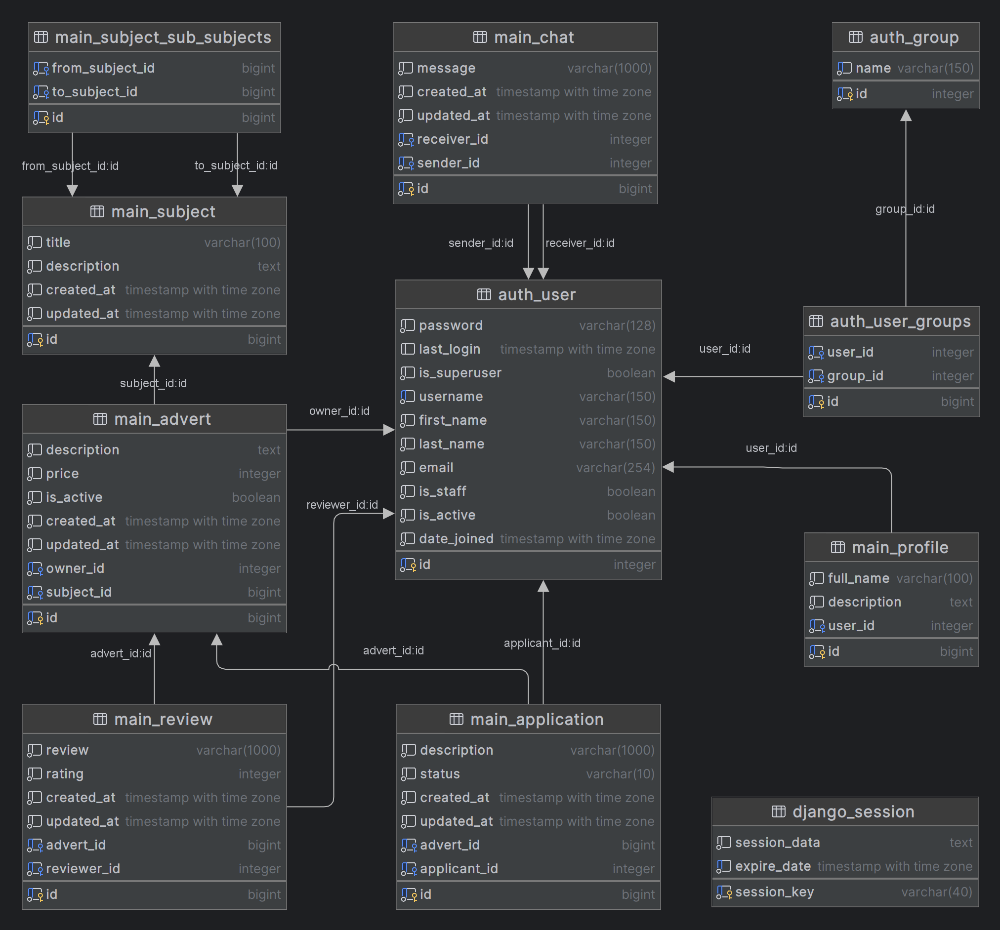

# Iemacies

Private teacher search platform

## About

The app's development was focused on learning the Django framework and its features. Design was added using **django-tailwind**.

## Features

- User roles (student, teacher, admin)
- Users can only modify their own data, for example, students can only edit their own applications

### Guest

- View subjects, teacher, adverts and reviews
- Register and login

### Logged in user

- View and edit profile
- Chat with related users (those with whom there is an open application)

### Student

- Create and edit applications
- Create and edit reviews only for finished applications

### Teacher

- Create and edit adverts
- Approve and reject applications

### Admin

- Create and edit subjects using **Django admin panel**
- Give and remove teacher role using **Django admin panel**

## Local deployment instructions

### Using **Docker**

1. Clone the repository and navigate to the project folder
2. Create the container `docker create --name iemacies -p 8000:8000`
3. Start the container `docker start iemacies`

#### Notes

- The database is stored in the container, so it will be lost after the container is deleted

### Using python **venv** *(Tested on Windows 11)*

#### Requirements

- Python
- Node.js
- npm
- PostgreSQL (optional)

#### Steps

1. Setup the database (optional, will use **sqlite** by default)
   1. Install and setup **postgresql**
   2. Create a database
   3. Create a `.env` file using the `.env.example`
   4. Modify the `DATABASES` section in `settings.py`
2. Clone the repository and navigate to the project folder
3. Setup python environment
   1. Create the virtual environment `python -m venv venv`
   2. Activate the **venv** `venv\Scripts\activate`
   3. Install the **pip** dependencies `pip install -r requirements.txt`
4. Run the database migrations `python manage.py migrate`
5. Seed the database using fixtures `python manage.py loaddata fixtures.json`
6. Install the **django-tailwind** dependencies `python manage.py tailwind install`
7. Run the **django-tailwind** development server `python manage.py tailwind start`
8. Run the **django** development server `python manage.py runserver`

## Usage

Web application is available at <http://127.0.0.1:8000/>

Admin panel is available at <http://127.0.0.1:8000/admin/>

There are 3 users (student, teacher, admin) with the password **password** for each of them. You can login with any of them or create a new user.

## Commands for development

- To save the **pip** dependencies `pip freeze > requirements.txt`
- To save database data to fixture file `python -Xutf8 manage.py dumpdata main auth.user auth.group -o  fixtures_new.json`

## Screenshots

### Student's profile detail page

### Teacher's profile detail page

### Chat detail page

### Subject list page

### Subject detail page

### Advert list page

### Student's advert detail page

### Teacher's advert detail page

### Advert create page

## Database diagram

